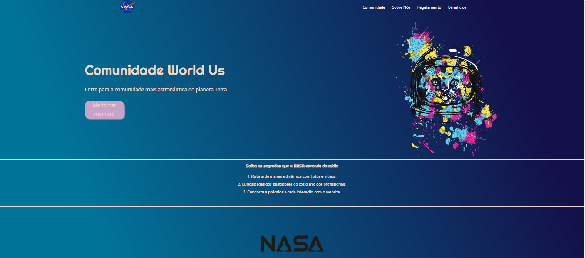

# Landing-Page
Landing page inspirado no tutorial de Rafaella Ballerini

## Introdução

Esse é um projeto para criar uma landing page, comum na área de Marketing e Sistemas web inspirado no tutorial da Rafaella Ballerini onde usei a ideia de criar para apaixonados e que gostam de acompanhar os eventos da NASA, surgindo uma comunidade fictícia.

## Linguagens Utilizadas
Para esse projeto, utilizei HTML e CSS apenas, é um projeto simples sem questões de responsividade e conceitos avançados desses sistemas.

## Resultado do Projeto

